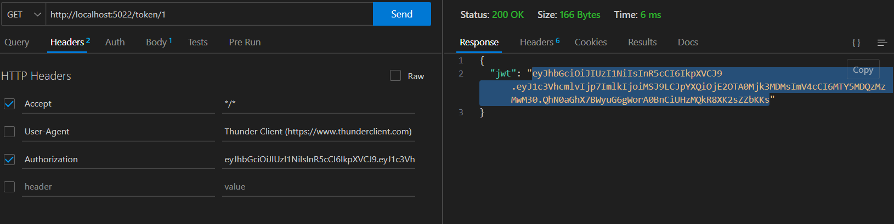

# Programming Backend Project

## Descripción

Este repositorio marca el inicio del proyecto backend, que tiene como objetivo desarrollar la parte central y funcional del sistema. Aquí se encontrarán todos los archivos y recursos relacionados con la lógica del negocio, bases de datos, API, servicios web, y cualquier otro componente necesario para el funcionamiento del proyecto.

## Objetivos

El proyecto backend tiene los siguientes objetivos principales:

- Diseñar y desarrollar una arquitectura robusta y escalable.
- Implementar la lógica del negocio y las funcionalidades requeridas.
- Establecer la comunicación con las bases de datos y el consumo de API.
- Consumir una API de sismos en tiempo real
- Modificar la API consumida para poder ver solo lo necesario.
- Dar opción al usuario para contarnos de su experiencia con el sismo.

El objetivo de este proyecto es por medio de la ayuda de una API de sismos en tiempo real consumirla y solo mostrar los caracteres esenciales mostrando datos de los sismos en tiempo real; además de darle la oportunidad a los usuarios de poder insertar sus experiencias como: si les afectó el temblor, que daños tubo, en que parte del mundo, ¿ha experimentado temblores antes?,  que sintió en el momento del temblor, que acciones toman al momento del sismo, ¿haz notado alguna diferencia a comparación del ultimo temblor?, etc. De esta manera tener un registro tanto de los sismos como de las experiencias de los usuarios de acuerdo a su ubicación

El nombre del proyecto es **"Seismic Activity Recorder"**


### Diagrama de entidad relación


### DataBase Seismic_Activity_Recorder

Se debe crear la base de datos Seismic_Activity_Recorder con sus respectivas relaciones de acuerdo al diagrama entidad relación hecho anteriormente, la cual contiene las siguientes tablas:

- Sismo : Contiene todos los datos de los sismos (características)
- Usuario: Usuarios afectados o que quieran contar acerca del momento que vivieron la experiencia
- Daño : Contiene la descripcion y explicación de daños que hubo por el sismo
- Experiencia : Contiene la experiencia ingresada por los usuarios acerca del sismo
- Localización : Muestra el lugar donde los usuarios estubieron mientras el sismo estaba ocurriendo

### Consumo Api de Sismos 

Se consumió una api de sismo para obtener los datos a insertar en la tabla sismo de la base de datos Seismic_Activity_Recorder, pero de la api solo se tomaron los siguientes datos de la tabla que son: idSismo

- *fecha*
- *hora_local*
- *magnitud*
- *tipo_mag*
- *profundidad_km*
- *intensidad_max*
- *area_epicentro*

La api seleccionada para el consumo e inserción de datos es: https://earthquake.usgs.gov/earthquakes/feed/v1.0/summary/2.5_week.geojson

###### Nueva columna, tabla sismo

Se insertó una nueva columna en la tabla sismo de la base de datos para poder insertar mejor el id del sismo por el motivo de que es tipo de dato varchar, y se le agregó la otra columna para utilizar un idSismo aparte y tenerlo con primary key para poder hacer las relaciones

### Instalación de dependencias por defecto

Utiliza este comando en la terminal para poder instalar las dependencias que tiene por defecto

`npm i`

#### Instalación completa y rapida

Si quieres saber como instalar todas las dependencias necesarias este es el comando, ten en cuenta que ya las instalaste al momento que pusiste  npm i

`npm i -E -D nodemon express dotenv mysql2 nanoid cookie-parser class-transformer reflect-metadata class-validator typescript jose` 

### Instalaciones dependencias ()

Estas son los comandos para la la instalación de cada paquete, si en dado caso quiere saber. No es necesario poner estos comandos por el motivo de que las dependencias vienen instaladas por defecto, solo debes poner el comando anterior

Packed.json

`npm init -y`

Instalación Nodemon

`npm i -E -D nodemon`

Instalar Express

`npm i -E express`

Instalar dotenv

`npm i -E -D dotenv`

Instalar mysql2

`npm i -E -D mysql2`

Instalar nanoid

`npm i -E -D nanoid`

Instalar clase transformer

`npm i -E -D class-transformer`

Instalar reflect metadata

`npm i -E -D reflect-metadata`

Instalar typescript

`npm i -E -D typescript`

Instalar cookie-parser

`npm i -E -D cookie-parser`

Instalar class-validator

`npm i -E -D class-validator`

Instalar jose

`npm i -E -D jose`


## Configuración del .env

Crea el archivo .env e inserta la siguiente configuración:

```
MY_CONFIG={"hostname": "localhost", "port":5022}
MY_CONNECT={"host":"localhost","user":"root","database":"Seismic_Activity_Recorder", "port":3306}
```

En MY_CONNECT :

- "user": "root" reemplaza root por su user
- Si en dado caso que tengas contraseña ingresa en la configuracion antes del port     ( "password":"tu_contraseña")


## Configuración del tsconfig

```
{
    "compilerOptions":{
        "target":"es6",
        "module":"ES6",
        "moduleResolution":"node",
        "outDir":"./controller",
        "esModuleInterop":true,
        "experimentalDecorators":true,
        "emitDecoratorMetadata": true
    }
}
```

## Comandos para el funcionamiento

Para poder hacer que el proyecto funcione debe ejecutar el siguiente comando en la terminal_

- `npm run dev`

Ese comando sirve para levantar el servidor y poder trabajar en el correctamente, una vez puesto este comando, crea otra terminal sin cerrar la otra para ejecutar el siguiente comando si en dado caso la carpeta controller no este disponible y poder correr la configuración tsconfig:

- `npm run tsc`


#### ¡¡Importante!!
##### La herramienta a utilizar para verificar el funcionamiento es Thunder Client


DataBase
Abre el la carpeta "db", luego abre el archivo db.sql:

Crea la base de datos dandole click en el comentario (Execute) que aparece encima de ( 
CREATE DATABASE Seismic_Activity_Recorder
 ).

Luego de aver creado la base de datos debes usarla para trabajar en ella, para esto dale click a ejecutar el comentario (Execute) que aparece encima de ( 
USE Seismic_Activity_Recorder;
 ).

Despues de usar la tabla debes seleccionar unicamente las 5 tablas para darle click en (Run debug SQL) que aparece en la parte superior.
Debes generar el token teniendo la extension de ThunderCLient y teniendo en cuenta los siguientes pasos:

Utiliza la siguiente url en metodo get: http://localhost:5022/token/1. esto te generará un token (copia)
Debes ponerlo en HTTP headers, agregas: Authorization y al frente pones el token generado (pegas)



Si en dado caso se acaba el tiempo de ese token debes volver a generar otro haciendo todo el proceso para generarlo y ya nuevamente podrás volver a manipular los datos
("El token generado tiene un tiempo muy extenso para la prueba de este proyecto").

Ojo para poder manipular la data debes tener presente el token generado en todo momento, puedes dejar quieto el header con la Authorization y su token en cada momento, solo cambia los metodos (get, post, put, delete) y los links, y si es necesario para los metodos post o put manipula el body sin quitar la Authorization con su token

En la parte de post sigue las instrucciones para poder ingresar los datos de la tabla sismo, luego de realizar el post redirigete aca para seguir con las instrucciones. Una vez seguido los pasos vuelve a la carpeta db al archivo db.sql, selecciona los datos a insertar y dale click a ejecutar

### Router: Sismo

*Ojo para poder manipular la data debes tener presente el token generado en todo momento, puedes dejar quieto el header con la Authorization y su token en cada momento, solo cambia los metodos(get, post, put, delete) y los links, y si es necesario para los metodos post o put manipula el body sin quitar la Authorization con su token*

#### Post 

Se le agregó un post para asi poder enviar o agregar datos a la tabla sismo del contenido de la api; para esto debe ponerlo en el metodo post y solo darle send, automáticamente se inserta la data consumida por la api

- http://localhost:5022/sismo/informacion/sent

Le deberá salir: `Los datos insertados correctamente`

#### Get

Se realizó la consulta get para poder obtener todos los datos acerca de los sismos

- http://localhost:5022/sismo/informacion 

Lo cual debe salir lo siguiente:

```
{
    "idSismo": 1,
    "id": "nn00863322",
    "fecha": "1899-11-30T04:56:16.000Z",
    "hora_local": "12:26:10",
    "magnitud": "3",
    "tipo_mag": "ml",
    "profundidad_km": "1",
    "intensidad_max": 104,
    "area_epicentro": "Nevada"
  },
  {
    "idSismo": 2,
    "id": "ci39623042",
    "fecha": "1899-11-30T04:56:16.000Z",
    "hora_local": "03:49:00",
    "magnitud": "3",
    "tipo_mag": "ml",
    "profundidad_km": "9",
    "intensidad_max": 97,
    "area_epicentro": "19km NNE of Ridgecrest, CA"
  }
```


#### Post

Se le agregó otro post para asi poder enviar o agregar datos a la tabla sismo que sean diferentes a los de la api, o simplemente agregar un dato y no todos a la ves, para esto pon la siguiente url

- http://localhost:5022/sismo/informacion/sent/data

Seguido de esto inserta estos datos

```
{
    "id": "nn3363322",
    "fecha": "2006-10-30",
    "hora_local": "10:26:10",
    "magnitud": "7",
    "tipo_mag": "mb",
    "profundidad_km": "1",
    "intensidad_max": 67,
    "area_epicentro": "Colombia"
  }
```


#### Put

Se le agregó un put para que pudiera actualizar los datos por medio del id, asi seleccionando que datos quiere actualizar y volver a enviarlos, colócalo en el metodo put y mete el siguiente enlace

- http://localhost:5022/sismo/update/1

Inserta estos datos en el body para actualizar el id seleccionado

```
{
    "id": "333b3b",
    "fecha": "2006-11-30",
    "hora_local": "12:26:10",
    "magnitud": "45",
    "tipo_mag": "mb",
    "profundidad_km": "4",
    "intensidad_max": 33,
    "area_epicentro": "Piedecuesta"
  }
```

Te saldrá:  `Registro actualizado exitosamente`


#### Delete

Se le agregó un delete con su id para poder eliminar únicamente la información unida a ese id, coloca la siguiente url luego de esto, selecciona el metodo delete y dale click a send, luego de esto te podrás dar cuenta que te va a dar un OK y podrás notar que ya no estará los datos de ese id

- http://localhost:5022/sismo/informacion/eliminar/251


Se le agregó otro delete para borrar todos los datos de la tabla sismo (Ojo Se recomienda no darle ejecutar esta url, si en dado caso le das vuelve a enviar la data con el primer post mostrado anteriormente)

- http://localhost:5022/sismo/informacion/delete

##### DTO sismo

Se le aplicó el dto a la tabla sismo para que de este modo los datos que entren, entren de forma correcta, el post y put fueron donde se les llamo el proxySismo para validar los datos de entrada


### Generar un token para pode visualizar, enviar, actualizar y borrar data: Localización(Importante)

Para generar un token es importante realizar los siguientes pasos: 

1. Utiliza la siguiente url en metodo get: http://localhost:5022/token/1. esto te generará un token (copia)
2. Debes ponerlo en HTTP headers, agregas: Authorization y al frente pones el token generado (pegas)


Si en dado caso se acaba el tiempo de ese token debes volver a generar otro haciendo todo el proceso para generarlo y ya nuevamente podrás volver a manipular los datos
("El token generado tiene un tiempo muy extenso para la prueba de este proyecto")

### Router: Localización

#### Get

Se realizó la consulta get para así poder obtener toda la data de la tabla localizacion, inserta esta url

- http://localhost:5022/localizacion/lugar

Como resultado a esto te mostrará:

```
  {
    "idLocalizacion": 1,
    "latitud": "12.345678",
    "longitud": "-98.765432",
    "ciudad": "Ciudad A"
  },
  {
    "idLocalizacion": 2,
    "latitud": "23.456789",
    "longitud": "-87.654321",
    "ciudad": "Ciudad B"
  },
  {
    "idLocalizacion": 3,
    "latitud": "34.567890",
    "longitud": "-76.543210",
    "ciudad": "Ciudad C"
  }...
```


#### Post

Se realizó un post para asi poder enviar datos de localización del usuario, inserta el siguiente enlace en el body inserta los siguientes datos:

- http://localhost:5022/localizacion/lugar/sent

```
{
    "latitud": "23.409825",
    "longitud": "-847.099843",
    "ciudad": "Bucaramanga"
  }
```


#### Put

Se realizó un put para poder actualizar datos de la localizacion del usuario, poniendo el id en la url del dato que se quiere actualizar para asi luego enviarlo con los datos actualizados, ingresa el siguiente enlace, luego de esto ingresa la data para que arroje: Registro actualizado exitosamente

- http://localhost:5022/localizacion/lugar/update/idLocalizacion

```
{
    "latitud": "23.1245",
    "longitud": "-847.099843",
    "ciudad": "Lebrija"
  }
```


#### Delete

Se le agregó un delete para de esta forma eliminar los datos específicos que quiere con poner solo el id en la url, ingresa la siguiente url y dale click a send para que te muestre lo siguiente: OK y podrás notar que ese registro ya no esta

- http://localhost:5022/localizacion/lugar/del/11


##### DTO Localizacion

Se le aplicó el dto a la tabla lozalizacion para que de este modo los datos que entren, entren de forma correcta, el post y put fueron donde se les llamo el proxyLocalizacion para validar los datos de entrada


### Generar un token para pode visualizar, enviar, actualizar y borrar data: Daño(Importante)

Para generar un token es importante realizar los siguientes pasos: 

1. Utiliza la siguiente url en metodo get: http://localhost:5022/token/1. esto te generará un token (copia)
2. Debes ponerlo en HTTP headers, agregas: Authorization y al frente pones el token generado (pegas)


Si en dado caso se acaba el tiempo de ese token debes volver a generar otro haciendo todo el proceso para generarlo y ya nuevamente podrás volver a manipular los datos
("El token generado tiene un tiempo muy extenso para la prueba de este proyecto")

### Router: Daño

#### Get

Se realizó la consulta get para así poder obtener toda la data de la tabla daño, ingresa el siguiente enlace con el metodo get para obtener toda la data de la tabla daño

- http://localhost:5022/dano/obt

#### Post

Se realizó un post para asi poder enviar datos de los daños, para esto ingresa la siguiente url en metodo post ademas de agregar los siguientes datos al body

- http://localhost:5022/dano/clase/sent

    {
    "idSismo": 2,
    "tipoDaño": "Destructivo",
    "descripcion": "Se destruyo la gran cantidad de casas y algunas quedaron con grietas"
    }


#### Put

Se realizó un put para poder actualizar datos los daños, poniendo el id en la url del dato que se quiere actualizar para asi luego enviarlo con los datos actualizados, para esto ingresa la url, selecciona el metodo ademas de ingresar o actualizar la data

- http://localhost:5022/dano/clase/update/5

    {"idSismo": 3,
    "tipoDaño": "Derrumbe",
    "descripcion": "Derrumbes"}
#### Delete

Se le agregó un delete para de esta forma eliminar los datos específicos que quiere con poner solo el id en la url, para esto ingresa la url y selecciona el metodo y podras notar como ese registro es eliminado

- http://localhost:5022/dano/clase/del/11

##### DTO Daño

Se le aplicó el dto a la tabla dañopara que de este modo los datos que entren, entren de forma correcta, el post y put fueron donde se les llamo el proxyDano para validar los datos de entrada


### Generar un token para pode visualizar, enviar, actualizar y borrar data: Daño(Importante)

Para generar un token es importante realizar los siguientes pasos: 

1. Utiliza la siguiente url en metodo get: http://localhost:5022/token/1. esto te generará un token (copia)
2. Debes ponerlo en HTTP headers, agregas: Authorization y al frente pones el token generado (pegas)


Si en dado caso se acaba el tiempo de ese token debes volver a generar otro haciendo todo el proceso para generarlo y ya nuevamente podrás volver a manipular los datos
("El token generado tiene un tiempo muy extenso para la prueba de este proyecto")

### Router: Usuario

#### Get

Se realizó la consulta get para así poder obtener toda la data de la tabla usuario, para esto ingresa la url y selecciona el metodo a utilizar luego de esto dale send

- http://localhost:5022/user/info

```
{
    "idUsuario": 1,
    "nombre": "Juan",
    "apellido": "Pérez",
    "correo": "juan@example.com",
    "fech_registro": "2023-07-26T05:00:00.000Z",
    "telefono": 1234567890,
    "idLocalizacion": 1
  },
  {
    "idUsuario": 2,
    "nombre": "María",
    "apellido": "Gómez",
    "correo": "maria@example.com",
    "fech_registro": "2023-07-26T05:00:00.000Z",
    "telefono": 2147483647,
    "idLocalizacion": 2
  }
```

#### Post

Se realizó un post para asi poder enviar datos de los usuarios, ingresa la url, selecciona el metodo, luego de esto ingresa los datos y dale send, (fecha_registro no es necesaria ponerla, por tal motivo que se genera automaticamente)

- http://localhost:5022/user/sent

```
{
    "nombre": "Juan",
    "apellido": "Quintero",
    "correo": "juan@Quinteo.com",
    "telefono": 3162915209,
    "idLocalizacion": 1
  }
```

#### Put

Se realizó un put para poder actualizar  los datos de usuarios, poniendo el id en la url del dato que se quiere actualizar para asi luego enviarlo con los datos actualizados. Para la utilización de este ingresa la url y elije el metodo, luego ingresa los datos para actualizar (fecha_registro no es necesaria ponerla, por tal motivo que se genera automaticamente)

- http://localhost:5022/user/update/:idUsuario

```
{
    "nombre": "Juan",
    "apellido": "Argüello",
    "correo": "juan@Argüello.com",
    "telefono": 34565754,
    "idLocalizacion": 1
  }
```

#### Delete

Se le agregó un delete para de esta forma eliminar los datos específicos que quiere con poner solo el id en la url, ingresa la url para eliminar el dato segun el id en la url

- http://localhost:5022/user/del/15

##### DTO Usuario

Se le aplicó el dto a la tabla Usuario para que de este modo los datos que entren, entren de forma correcta, el post y put fueron donde se les llamo el proxyUsuario para validar los datos de entrada

(No se le aplicó el dto a la fecha de registro ya que lo toma automáticamente del sistema, en si no se necesita validación)


### Generar un token para pode visualizar, enviar, actualizar y borrar data: Daño(Importante)

Para generar un token es importante realizar los siguientes pasos: 

1. Utiliza la siguiente url en metodo get: http://localhost:5022/token/1. esto te generará un token (copia)
2. Debes ponerlo en HTTP headers, agregas: Authorization y al frente pones el token generado (pegas)


Si en dado caso se acaba el tiempo de ese token debes volver a generar otro haciendo todo el proceso para generarlo y ya nuevamente podrás volver a manipular los datos
("El token generado tiene un tiempo muy extenso para la prueba de este proyecto")

### Router: Experiencia

#### Get

Se realizó la consulta get para así poder obtener toda la data de la tabla experiencia, para poder ver el resultado copia y pega el link, selecciona el metodo y veras el resultado:

- http://localhost:5022/experiencia/info

```
 {
    "idExperiencia": 1,
    "idUsuario": 1,
    "idSismo": 1,
    "fecha": "2023-07-01T05:00:00.000Z",
    "tex_comentario": "Excelente experiencia",
    "idDaño": 1
  },
  {
    "idExperiencia": 2,
    "idUsuario": 2,
    "idSismo": 2,
    "fecha": "2023-07-05T05:00:00.000Z",
    "tex_comentario": "Muy impactante",
    "idDaño": 2
  }
```

#### Post

Se realizó un post para asi poder enviar las experiencias de los usuarios, ingresa el link y selecciona el metodo, luego de esto envia la siguiente data y podras verificar con el get que fueron agregados

- http://localhost:5022/experiencia/sent

    {"idUsuario": 3,
    "idSismo": 3,
    "fecha": "2023-07-01T05:00:00.000Z",
    "tex_comentario": "UNa experiencia tragica y desgaradora",
    "idDaño": 3}
  
  #### Put

Se realizó un put para poder actualizar las experiencias de los usuarios, poniendo el id en la url del dato que se quiere actualizar para asi luego enviarlo con los datos actualizados, para comprobarlo ingresa el link y selecciona el metodo put, ingresa los datos para actualizarlo

- http://localhost:5022/experiencia/update/:idExperiencia

```
{"idUsuario": 5,
"idSismo": 2,
"fecha": "2000-07-01T05:00:00.000Z",
"tex_comentario": "UNo quiero volver a vivir esa experiencia",
"idDaño": 3}
```

#### Delete

Se le agregó un delete para de esta forma eliminar los datos específicos que quiere con poner solo el id en la url, para comprobar o dicho ingresa la url, elije el metodo a trabajar y pon el id para eliminar

- http://localhost:5022/experiencia/del/:idExperiencia

##### DTO Experiencia

Se le aplicó el dto a la tabla Experiencia para que de este modo los datos que entren, entren de forma correcta, el post y put fueron donde se les llamo el proxyExperiencia para validar los datos de entrada

