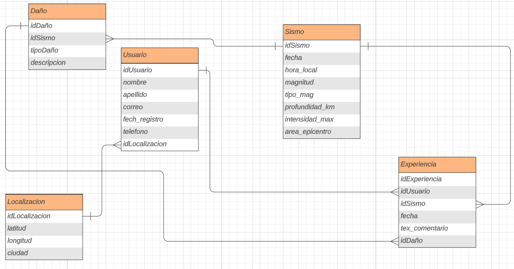

# Programming Backend Project

## Descripción

Este repositorio marca el inicio del proyecto backend, que tiene como objetivo desarrollar la parte central y funcional del sistema. Aquí se encontrarán todos los archivos y recursos relacionados con la lógica del negocio, bases de datos, API, servicios web, y cualquier otro componente necesario para el funcionamiento del proyecto.

## Objetivos

El proyecto backend tiene los siguientes objetivos principales:

- Diseñar y desarrollar una arquitectura robusta y escalable.
- Implementar la lógica del negocio y las funcionalidades requeridas.
- Establecer la comunicación con las bases de datos y el consumo de API.
- Consumir una API de sismos en tiempo real
- Modificar la API consumida para poder ver solo lo necesario.
- Dar opción al usuario para contarnos de su experiencia con el sismo.

El objetivo de este proyecto es por medio de la ayuda de una API de sismos en tiempo real consumirla y solo mostrar los caracteres esenciales mostrando datos de los sismos en tiempo real; además de darle la oportunidad a los usuarios de poder insertar sus experiencias como: si les afectó el temblor, que daños tubo, en que parte del mundo, ¿ha experimentado temblores antes?,  que sintió en el momento del temblor, que acciones toman al momento del sismo, ¿haz notado alguna diferencia a comparación del ultimo temblor?, etc. De esta manera tener un registro tanto de los sismos como de las experiencias de los usuarios de acuerdo a su ubicación

El nombre del proyecto es **"Seismic Activity Recorder"**

### Diagrama de entidad relación

